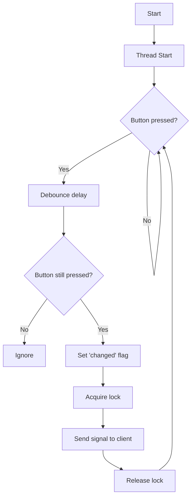

```mermaid
graph TD;
    A[Start] --> B[Thread Start];
    B --> C{Button pressed?};
    C -->|No| C;
    C -->|Yes| D[Debounce delay];
    D --> E{Button still pressed?};
    E -->|No| F[Ignore];
    E -->|Yes| G[Set 'changed' flag];
    G --> H[Acquire lock];
    H --> I[Send signal to client];
    I --> J[Release lock];
    J --> C;
```