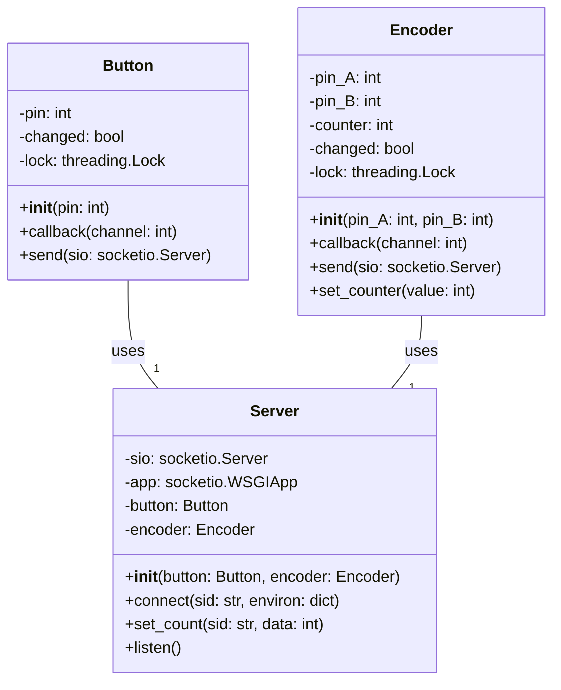

```mermaid
classDiagram
    class Button{
        -pin: int
        -changed: bool
        -lock: threading.Lock
        +__init__(pin: int)
        +callback(channel: int)
        +send(sio: socketio.Server)
    }
    class Encoder{
        -pin_A: int
        -pin_B: int
        -counter: int
        -changed: bool
        -lock: threading.Lock
        +__init__(pin_A: int, pin_B: int)
        +callback(channel: int)
        +send(sio: socketio.Server)
        +set_counter(value: int)
    }
    class Server{
        -sio: socketio.Server
        -app: socketio.WSGIApp
        -button: Button
        -encoder: Encoder
        +__init__(button: Button, encoder: Encoder)
        +connect(sid: str, environ: dict)
        +set_count(sid: str, data: int)
        +listen()
    }
    Button -- "1" Server: uses
    Encoder -- "1" Server: uses
```