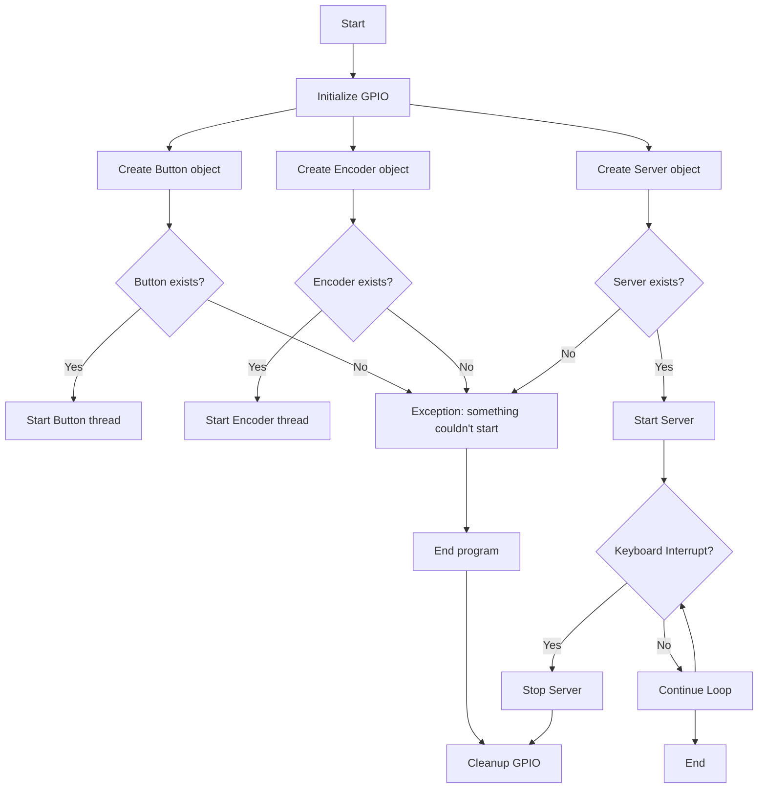

```mermaid
graph TD;
    A[Start] --> B[Initialize GPIO];
    B --> C[Create Button object];
    B --> D[Create Encoder object];
    B --> E[Create Server object];
    C --> F{Button exists?};
    D --> G{Encoder exists?};
    E --> H{Server exists?};
    F -->|Yes| I[Start Button thread];
    G -->|Yes| J[Start Encoder thread];
    H -->|Yes| K[Start Server];
    F -->|No| L[Exception: something couldn't start];
    G -->|No| L;
    H -->|No| L;
    L --> R[End program]
    R --> O
    K --> M{Keyboard Interrupt?};
    M -->|Yes| N[Stop Server];
    M -->|No| P[Continue Loop];
    P --> M;
    N --> O[Cleanup GPIO];
    P --> Q[End];
```