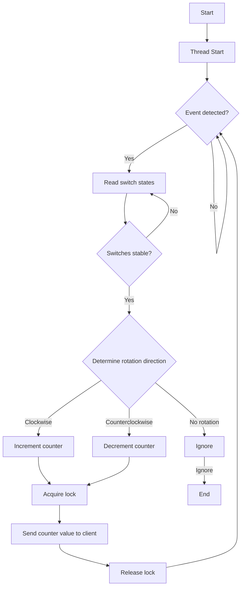

```mermaid
graph TD;
    A[Start] --> B[Thread Start];
    B --> C{Event detected?};
    C -->|No| C;
    C -->|Yes| D[Read switch states];
    D --> E{Switches stable?};
    E -->|No| D;
    E -->|Yes| F{Determine rotation direction};
    F -->|Clockwise| G[Increment counter];
    F -->|Counterclockwise| H[Decrement counter];
    F -->|No rotation| I[Ignore];
    G --> J[Acquire lock];
    H --> J;
    I -->|Ignore| K[End];
    J --> L[Send counter value to client];
    L --> M[Release lock];
    M --> C;
```